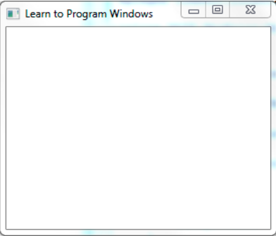

# 使用C++进行Win32编程

## 1. 什么是窗口

### 窗口类型

  
上图称为程序窗口(Application Window)，包含标题栏、最大化、最小化按钮的这一部分叫做帧(Frame)，帧是非客户区域，由操作系统来管理，帧内部的白色区域则为客户区域，由编写的程序管理。

  
这是另一种类型的窗口，UI控制必须放置在程序窗口上。

### 父窗口和附属窗口

程序窗口是控制窗口的父窗口，程序窗口是对话框窗口的拥有窗口，或者说对话框窗口是程序窗口的附属窗口。父窗口和子窗口的位置固定，子窗口不可能出现在父窗口外面，对话框窗口常显示在程序窗口前面，关系可表示如下：

## 2. 窗口句柄

窗口是一种对象，但不是C++的类的对象，程序通过一个值来引用窗口，这个值叫做句柄，句柄就是一个数，被操作系统用来标识一个对象，句柄不是指针，不指向某个值。

## 3. 数据类型

数据类型                                  意义
BOOL                   Boolean值（布尔值，不是TRUE就是FALSE）
BSTR                   32-bit字符指针
BYTE                   8-bit整数，未带正负号
COLORREF               32-bit 数值，代表一个颜色值
DWORD                  32-bit 整数，未带正负号
LONG                   32-bit 整数，带正负号
LPARAM                 32-bit 数值，做为窗口函数或 callback 函数的一个参数
LPCSTR                 32-bit 指针，指向一个常数字符串
LPSTR                  32-bit 指针，指向一个字符串
LPCTSTR                32-bit 指针，指向一个常数字符串。此字符串可移植到Unicode和DBCS（双字节字集）
LPTSTR                 32-bit 指针，指向一个字符串。此字符串可移植到  Unicode和DBCS（双位组字集）
LPVOID                 32-bit 指针，指向一个未指定类型的数据
LPRESULT               32-bit数值，做为窗口函数或callback函数的回返值
UINT                   在Win16中是一个16-bit未带正负号整数，在Win32中是一个  32-bit未带正负号整数。
WNDPROC                32-bit 指针，指向一个窗口函数
WORD                   16-bit 整数，未带正负号
WPARAM                 窗口函数的callback函数的一个参数。在Win16中是  16 bits，在Win32中是32 bits。
